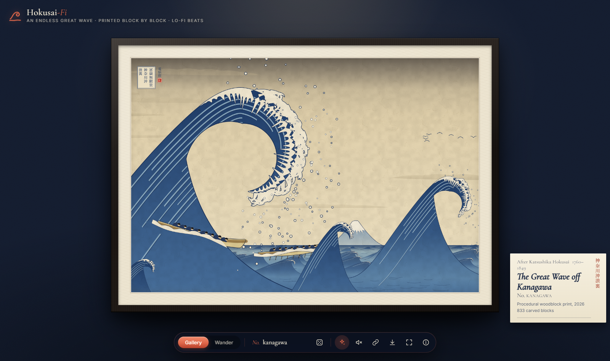
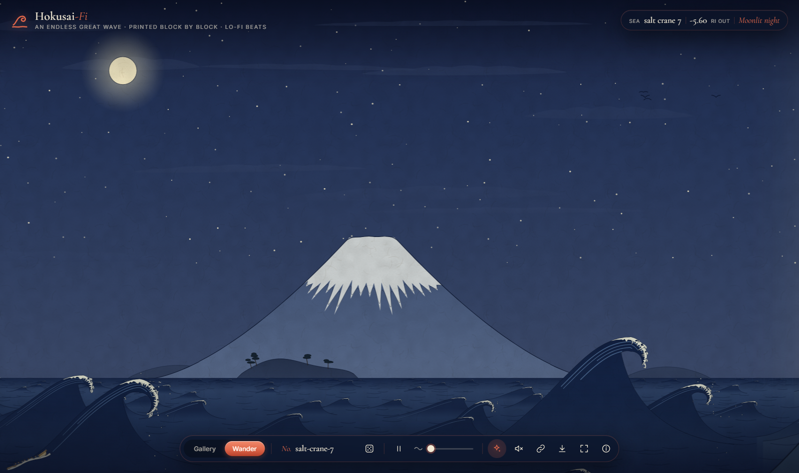

# Hokusai-Fi

An endless *Great Wave off Kanagawa*, procedurally printed block by block, with a generative lo-fi
soundtrack. A sibling of [Gogh with the Flow](https://github.com/EvanDongChen/GoghWithTheFlow), in
the spirit of [shan-shui-inf](https://github.com/LingDong-/shan-shui-inf), but cut in woodblocks
instead of brushed in oil.





## Two ways to look at it

- **Gallery**: a close reinterpretation of the c. 1831 print, framed with a washi mat on a gallery
  wall, with a placard that names its seed and counts its blocks. It has the great wave rearing
  up on the left with its claws of foam, spray falling like snow, three boats of rowers crouched
  at their oars, the small wave in front that echoes Fuji, and Fuji itself, snow-capped, far off
  in the trough. The title cartouche and a red seal carved from the seed sit in the corner. Each
  seed varies the details, may mirror the composition, and picks its weather.
- **Wander**: row sideways along an infinite sea, starting from the gallery print itself. The
  sea changes as you go, through regions borrowed from the rest of the *Thirty-six Views*:
  - **the Kanagawa sea**, where great waves rise and boats ride their backs;
  - **open swells** with fishing boats and distant sails;
  - **a calm bay under a large Fuji**, after *Fine Wind, Clear Morning* (Red Fuji in the evening);
  - **a coast of pine-covered headlands**;
  - **rocky islets** with pines and a vermilion shrine gate.

**Every seed is different.** Each region gets its own weather: a clear day, dawn with a red sun,
a red evening, a moonlit night with stars, a squall of slanting rain, or snowfall. The colour
blocks are recut for each, and blend as you cross from one region into the next.

Turn on **life** (on by default) and the print moves: spray leaps from the curling lips and falls
back, skeins of seabirds cross, snow drifts down, rain slants in, petals blow past at dawn, and
the sun and moon breathe.

The same seed always prints the same sea. Share a link and your friend sees exactly your sea.

## The Fi

Press `M` for the soundtrack, generated live with Web Audio, nothing sampled: a swung, dusty beat,
warm electric-piano seventh chords that duck under the kick, a round bass, a koto plucking a
Japanese pentatonic melody (with the occasional *oshide* bend), a breathy shakuhachi, a temple bell,
the sea rolling underneath and the crackle of an old record. The seed sets the key, the chord loop
and the drum pattern; the weather sets the scale and tempo (yo on a clear day, *in* by moonlight,
hirajoshi in the snow, iwato in a squall), so the music turns with the print as you wander. The
drums thin out over the calm bay and the sea swells louder over rough water.

## Run it

```sh
npm install
npm run dev      # http://localhost:5173
npm run build    # dist/index.html: one self-contained file (~125 KB)
```

The build is a single HTML file with everything inlined, so you can send it to someone and they
can just double-click it. No server needed.

### Publish on GitHub Pages

The repo includes `.github/workflows/deploy.yml`. Do this once: in the GitHub repo go to
**Settings → Pages → Source: GitHub Actions**. After that, every push to `main` publishes the site
to `https://evandongchen.github.io/Hokusai-Fi/`. Link previews use `public/og.jpg`.

| Input | Action |
| --- | --- |
| `G` / `W` | Gallery / Wander |
| `N` | A new sea |
| `A` | Bring the print to life / still it |
| `C` | Copy a link to this sea |
| `I` | About |
| `Space` | Pause or resume drifting |
| `←` `→`, drag, scroll | Row along the sea |
| `M` | Play / mute the lo-fi soundtrack |
| `S` | Save a postcard (`Shift+S`: plain PNG) |
| `F` | Fullscreen |

URL parameters: `?seed=salt-crane-7`, `&mode=wander`, `&speed=0..160`, `&animate=0`, `&intro=0`.

## How it works

Vite with plain TypeScript and no runtime dependencies. Everything is canvas 2D, printed the way a
woodblock print is: flat areas of colour, graded (*bokashi*) where the printer would wipe the block,
held together by the key block's thin Prussian-blue lines, on washi paper.

**One wave, many sizes.** Every wave, from the great one to the little crests near the horizon, is
the same construction (`src/world/wave.ts`): a back slope rising to the crest, a lip that curls
over as a tapering spiral, and a face that wraps part way round the hollow, left open so Fuji and
the sky show through it. Then its blocks are printed in order: a body graded from deep blue to the
sea, light bands carved along the back and on into the curl, the key-block outline, and the foam,
a white crest whose inner edge sends fingers down into the blue and whose outer edge breaks into
claws, each claw splitting into smaller curling talons. The foam and its claws are inked as one
union (stroke every shape at twice the line width, then fill them all), so they share a single
carved outline.

**Depth.** Nearer water prints over farther water: everything in the sea is ordered by where its
foot meets the water, so rows of small crests stack like scales toward the horizon and boats sit
between the waves they ride.

**An infinite world in chunks.** As in Gogh with the Flow, the world is cut into 740px-wide chunks,
each generating its features from `hash(seed, chunk)`, and every shape is drawn in world
coordinates with a global sort key, so neighbouring chunks print shared shapes identically and no
seam shows. Workers print chunks off the main thread in short slices, so you can watch the print
being pulled.

| Path | Role |
| --- | --- |
| `src/core/` | Seeded RNG and hashing, noise, colour helpers, print primitives (fills, keylines, inked unions) |
| `src/world/world.ts` | The classic layout, regions and weather, the colour blocks for each weather, chunked generation |
| `src/world/wave.ts` | The shape of a wave: back, curling lip, face round the hollow |
| `src/paint/sea.ts` | The sea's ground, ripples, rows of crests, and every block of each wave |
| `src/paint/sky.ts` | Graded sky, cloud bands, sun and moon, stars, snow and rain |
| `src/paint/shore.ts` | Fuji, far hills, pine headlands, islets with a shrine gate, distant sails |
| `src/paint/boats.ts` | Oshiokuri-bune with their crews, oars and the wash over their hulls |
| `src/paint/cartouche.ts` | The title cartouche and the seed's seal (drawn on the page, for its fonts) |
| `src/paint/chunks.ts`, `worker.ts`, `pool.ts` | Planning and printing chunks; the washi texture; the worker pool |
| `src/anim/life.ts` | The animation layer: spray, seabirds, weather, breathing sun and moon |
| `src/audio/music.ts` | The generative lo-fi soundtrack |
| `src/main.ts`, `src/styles.css` | Gallery, wander, dock, about panel, input, share, postcards |
