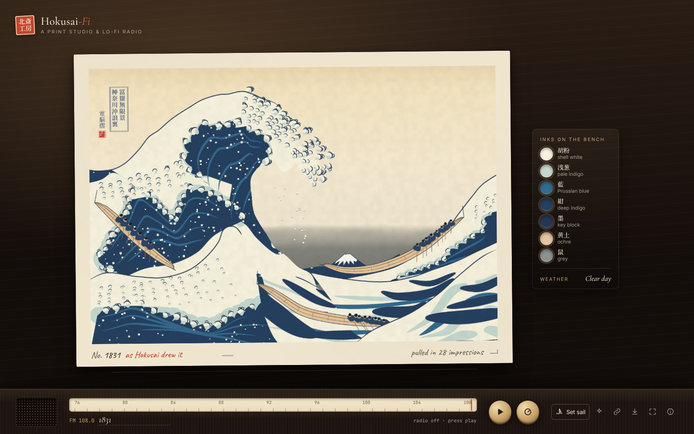
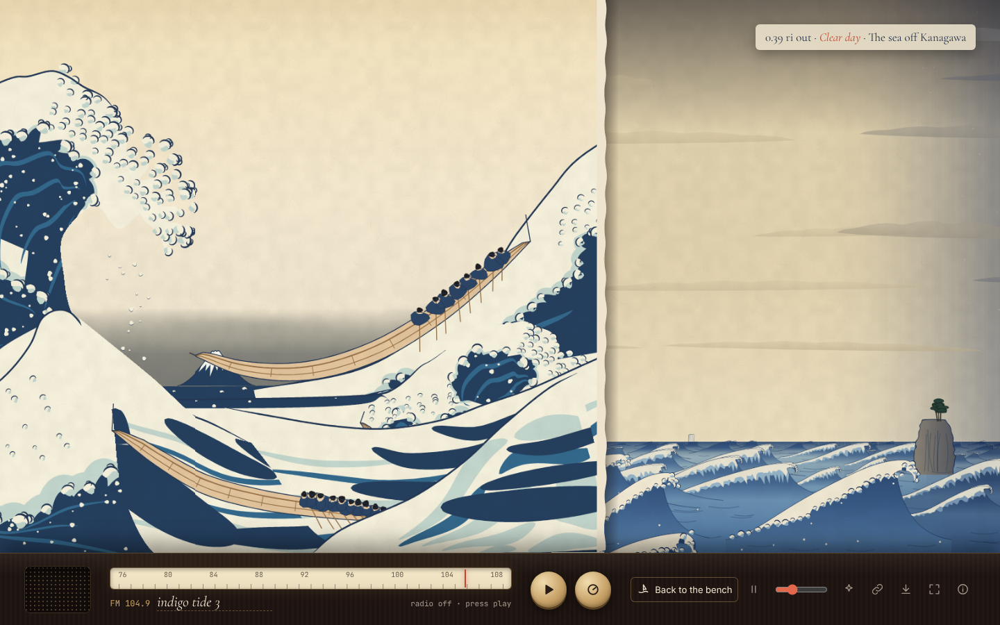
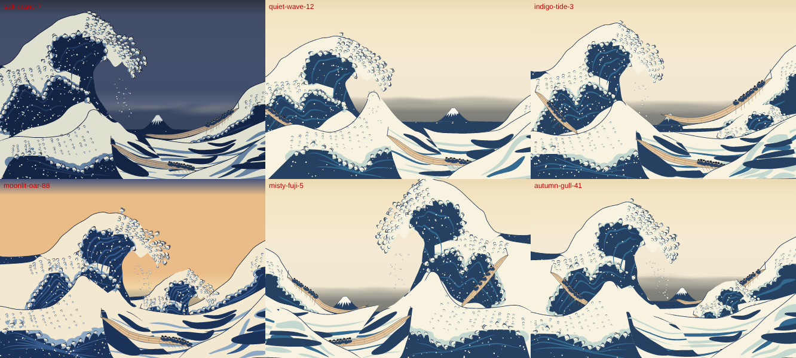

# Hokusai-Fi

A print studio and lo-fi radio. Every station you tune to pulls a new woodblock print in the
manner of Hokusai's *Under the Wave off Kanagawa*, carved entirely by code (no photographs, no
tracing), while the radio plays a generative lo-fi soundtrack composed from the same seed. Tune
to **1831** and the print is Hokusai's own composition.



## The studio

The print lies on a sheet of washi on a lamp-lit bench, with the carver's *kentō* registration
marks in its margin and pencil notes under it: its edition number, and how many impressions it
took to pull. Beside it, a tray holds a dish of each ink the edition is printed in, recut for its
weather. An old radio is the control surface:

- the **dial** tunes the sea: every seed has its own frequency, and typing a new station name
  pulls a new print;
- the **play** knob turns the radio on; its display shows the key, the scale the koto plays in
  and the tempo, and a level glows behind the speaker cloth;
- the **tune** knob finds a new station at random;
- **Set sail** opens the print out into an endless sea, printed just ahead of you as you row.



## Every seed is a new painting

Edition 1831 is Hokusai's composition. Every other seed composes its own painting from the same
parts (the great curling wave and its boat, the small wave that echoes Fuji, the striped swells,
the wave rising in the corner, the boats with their crews, Fuji):

- a **layout**: one great wave as in the original, two great waves one behind the other, a wall
  of water filling the sheet, or a lull with only swells and a large, near Fuji;
- each great wave's **size, lean and place**, and whether it breaks to the right or the left;
- the **horizon**, which boats are out, and **Fuji** set wherever the sky opens widest;
- the **carving** itself: finer or bolder fingers of blue, bigger or smaller talons, more or
  fewer strands and flecks;
- the **weather**: a clear day, dawn, a red evening, a moonlit night, a squall or snow, each
  recutting the colour blocks;
- and over all of it a seeded swell that pushes every curve a little.



The same seed always prints the same sea, so a shared link shows your friend exactly your print.

## Sailing

Set sail and the print opens out, its sheet ending in a deckled edge on the open sea. The sea
runs on through regions borrowed from the rest of the *Thirty-six Views*: the Kanagawa sea of
great waves, open swells with fishing boats, a calm bay under a large Fuji, a coast of pine
headlands, and rocky islets with a shrine gate, each region with its own weather. Its big waves
are carved the same way as the print's.

Turn on **life** and the print moves: spray leaps from the curling lips and falls back, skeins
of seabirds cross, snow drifts down, rain slants in, petals blow past at dawn, and the sun and
moon breathe.

## The Fi

The soundtrack is generated live with Web Audio, nothing sampled: a swung, dusty beat, warm
electric-piano seventh chords that duck under the kick, a round bass, a koto plucking a Japanese
pentatonic melody (with the occasional *oshide* bend), a breathy shakuhachi, a temple bell, the
sea rolling underneath and the crackle of an old record. The seed sets the key, the chord loop
and the drum pattern; the weather sets the scale and tempo (yo on a clear day, *in* by
moonlight, hirajoshi in the snow, iwato in a squall), so the music turns as you sail.

## Run it

```sh
npm install
npm run dev      # http://localhost:5173
npm run build    # dist/index.html: one self-contained file (~180 KB)
```

The build is a single HTML file with everything inlined, so you can send it to someone and they
can just double-click it. No server needed.

### Publish on GitHub Pages

The repo includes `.github/workflows/deploy.yml`. Do this once: in the GitHub repo go to
**Settings → Pages → Source: GitHub Actions**. After that, every push to `main` publishes the site
to `https://evandongchen.github.io/Hokusai-Fi/`. Link previews use `public/og.jpg`.

| Input | Action |
| --- | --- |
| `M` | Play / stop the radio |
| `N` | Tune to a new sea |
| `W` / `G` | Set sail / back to the bench |
| `←` `→`, drag, scroll | Row along the sea |
| `Space` | Hold still or drift |
| `A` | Bring the print to life / still it |
| `C` | Copy a link to this station |
| `S` | Pull a postcard (`Shift+S`: plain PNG) |
| `F` | Fullscreen |
| `I` | About |

URL parameters: `?seed=salt-crane-7`, `&mode=voyage`, `&speed=0..160`, `&animate=0`, `&intro=0`.

## How it works

Vite with plain TypeScript and no runtime dependencies. Everything is canvas 2D, printed the way a
woodblock print is: flat areas of colour, each from its own block, held together by the key
block's Prussian-blue lines, on washi paper.

**A composition, then carving.** `src/world/kanagawa.ts` holds what is where: a handful of curves
per element (the back of the great wave, the edge where its blue meets its foam, the hollow under
the lip, the crown of foam, the swells and their stripes, the boats' keels, Fuji) and a few numbers
telling the carving procedures how to work along them. `src/paint/ink.ts` holds the procedures,
Hokusai's marks:

- a **lobed edge**: where blue water meets white foam, the blue rises in rounded fingers that lean
  forward with the wave;
- a **talon**: a finger of foam that curls over at its end, outlined underneath by a dark hook,
  with a pale-indigo shadow pooled inside its curl; big talons split into smaller ones;
- a **crown**: talons packed over a mass of foam on a breaking crest;
- **strands** and **slivers**: long tapering stripes of lighter or darker blue running with the
  water;
- **flecks** of spray scattered over the blue and the sky.

Every mark is placed by these procedures from the seed. Within an element the blocks are laid
down as a printer lays them, lightest first: the paper of the water, pale indigo, blue, deep
blue, the white of the foam, and last the key block's lines and hooks.

**How close is 1831?** The composition's curves were tuned by an optimiser that nudged each
control point and carving parameter and kept whatever made the print agree better with the
original, measured as which ink (sky, foam, blue or boat) covers each cell of the print seen at
thumbnail size. Edition 1831 agrees with Hokusai's print in about 89% of those cells. The
reference was only used for that measurement and is not part of the project; the print is made
by the procedures alone, which is also why it can make every other edition.

**An infinite world in chunks.** The world is cut into 740px-wide chunks, each generating its
features from `hash(seed, chunk)`, and every shape is drawn in world coordinates with a global
sort key, so neighbouring chunks print shared shapes identically and no seam shows. The print
fills the first two chunks. Workers print chunks off the main thread in short slices, so you can
watch the print being pulled.

| Path | Role |
| --- | --- |
| `src/core/` | Seeded RNG and hashing, noise, colour helpers, splines and paths, print primitives |
| `src/world/kanagawa.ts` | Hokusai's composition, and the composer that makes every other edition from its parts |
| `src/paint/ink.ts` | The carving procedures: lobed edges, talons, crowns, slivers, flecks |
| `src/paint/kanagawa.ts` | Prints a composition: sky, Fuji, waves, boats and spray, block by block |
| `src/world/world.ts` | Regions and weather of the endless sea, the colour blocks for each weather, chunked generation |
| `src/world/wave.ts` | The shape of the sea's waves: back, curling lip, face round the hollow |
| `src/paint/sea.ts` | The sea's ground, ripples, rows of crests, and every block of each wave |
| `src/paint/sky.ts` | Graded sky, cloud bands, sun and moon, stars, snow and rain |
| `src/paint/shore.ts` | Fuji, far hills, pine headlands, islets with a shrine gate, distant sails |
| `src/paint/boats.ts` | Oshiokuri-bune with their crews, oars and the wash over their hulls |
| `src/paint/cartouche.ts` | The title cartouche and the seed's seal (drawn on the page, for its fonts) |
| `src/paint/chunks.ts`, `worker.ts`, `pool.ts` | Planning and printing chunks; the washi texture; the worker pool |
| `src/anim/life.ts` | The animation layer: spray, seabirds, weather, breathing sun and moon |
| `src/audio/music.ts` | The generative lo-fi soundtrack |
| `src/main.ts`, `src/styles.css` | The studio, the radio, sailing, input, sharing, postcards |
